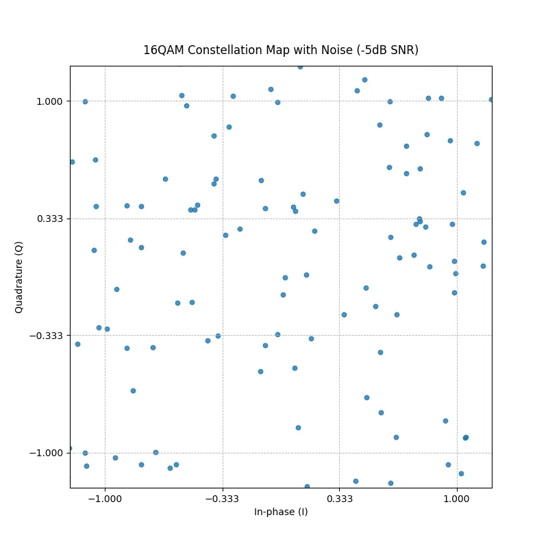

Orthogonal Frequency-Division Multiplexing (OFDM) is the modulation workhorse behind Wi-Fi, LTE/5G, and most broadband links. In this post we’ll walk through a minimal but functional OFDM transceiver built entirely in Python. We’ll cover every block (bit generation, 16-QAM mapping, IFFT framing, cyclic-prefix handling, AWGN injection, coherent reception, demapping, and BER analysis) while keeping the code compact.

## Quick Overview?

OFDM is a digital modulation technique that splits high-rate data streams into multiple lower-rate streams and transmits them simultaneously over many orthogonal subcarriers. This parallel transmission makes OFDM highly robust against frequency-selective fading and inter-symbol interference, especially in wireless channels.


By applying an Inverse Fast Fourier Transform (IFFT) at the transmitter and a Fast Fourier Transform (FFT) at the receiver, OFDM efficiently maps data into the frequency domain, allowing for scalable, bandwidth-efficient communication widely used in systems like Wi-Fi, LTE, and 5G. Let’s dive right in. Below is a block diagram showing key components/parts of a typical transceiver.


<center>Basic OFDM Block Diagram</center>

## Transmitter Side

### Bitstream Generation and 16QAM Mapping

Our primary aim was to study OFDM itself, so we delegated all the routine 16-QAM tasks to the 16QAM Communication Toolbox. This package conveniently supplies everything we need on both ends of the link: a bit-stream generator and slicer, a mapper that turns those bits into 16-QAM symbols, an AWGN noise source for channel testing, and a demapper that converts the received symbols back into the original bitstream. Offloading these constellation-level details lets us concentrate on designing and analysing the OFDM blocks. The code snippet below handles both bitstream generation and the subsequent 16-QAM symbol mapping.

```python
QAM16 = [-1, -0.333, 0.333, 1]

Ns = 256 # number of symbols
bits = 4 # bits per symbol
data = transmitter.qm.modulation.data_gen(Ns*bits)
dataI, dataQ = transmitter.qm.modulation.slicer(data)

mapI = transmitter.qm.modulation.mapper_16QAM(QAM16, dataI)
mapQ = transmitter.qm.modulation.mapper_16QAM(QAM16, dataQ)
plt.figure()
plot_constellation(mapI, mapQ) 
```

### Serial-to-Parallel Converter

Before applying the IFFT, the serial stream of modulated QAM data must be arranged into parallel segments , this is the role of the Serial-to-Parallel (S/P) conversion. The grid allocation logic does exactly this: it maps QAM symbols into rows (subcarriers) and columns (OFDM symbols), inserting pilot tones if defined. In this implementation, we omit pilot tones for simplicity. Pilot tones are known reference symbols inserted into specific subcarriers to help the receiver estimate and correct for channel impairments like phase noise, frequency offsets, and multipath fading.

While they are essential in real-world systems and moreso in wireless environments with unpredictable channels, our current setup assumes a clean baseband channel (with only AWGN) and perfect synchronization. This allows us to focus on the core OFDM mechanisms without the added complexity of channel estimation and equalization.

```python
grid = np.zeros((n_subcarriers, n_ofdm_symbols), dtype=complex)

data_iter = iter(data_symbols)
for sym in range(n_ofdm_symbols):
    if pilot_positions is not None:
        grid[pilot_positions, sym] = pilot_value
    
    for k in range(n_subcarriers):
        if pilot_positions is not None and k in pilot_positions:
            continue
        grid[k, sym] = next(data_iter)
```

This block ensures that each IFFT operates on a full set of subcarrier values at once, transforming a block of frequency-domain data into a time-domain OFDM symbol. This structure allows the receiver to easily reverse the process with a **Parallel-to-Serial (P/S)** conversion after applying the FFT, effectively recovering the original data stream on the receiver side.

### IFFT

The IFFT converts frequency-domain QAM symbols into a time-domain waveform, allowing multiple orthogonal sub-carriers to be transmitted in parallel without interference. To ensure that the signal’s energy remains consistent across the transformation, the IFFT output is scaled by √N, where N is the number of sub-carriers. This scaling makes the transform effectively unitary, preserving total signal power according to Parseval’s theorem. Without this adjustment, the time-domain signal would have lower power, leading to inaccurate SNR and BER measurements. We do this with a python one liner call to Numpy’s IFFT function/method.

```python
ofdm_time = np.fft.ifft(np.fft.ifftshift(grid, axes=0),
                axis=0)*np.sqrt(n_subcarriers)
```

### Cyclic Prefix

After generating the time-domain OFDM symbols with the IFFT, we prepend a cyclic prefix to each symbol to guard against inter-symbol interference caused by multipath. This is done by copying the last portion of each symbol and attaching it to the front. The result is a 2D array where each column represents one OFDM symbol with its cyclic prefix included. However, for actual transmission, the data must be sent as a continuous 1D time-domain stream, not as separate columns. To achieve this, we reshape the 2D matrix into a 1D array, effectively flattening the symbol columns into a serial stream.

```python
ofdm_w_cp = np.concatenate([ofdm_time[-cp_len:, :],
                               ofdm_time],
                               axis=0)
ofdm_cp = ofdm_w_cp.reshape(-1)
```

### Channel + AWGN Addition

For this, we made use of the toolbox’s channel function, which adds Additive White Gaussian Noise (AWGN) to a signal. The function takes three inputs: the signal, the desired Signal-to-Noise Ratio (SNR) in dB, and a scaling factor K. In our case, we set K = 1, which means the signal power is calculated as $\lvert sig \rvert ^{2}$, the standard behavior.

```python
tx_w_noise, noise = transmitter.qm.channel.add_awgn(tx, SNR = 20, K=1)
tx_w_noise_l, noise_l = transmitter.qm.channel.add_awgn(tx, SNR = -5, K=1)
```

If K were greater than 1, it would artificially boost the signal power, resulting in less noise being added for the same SNR. Conversely, setting K < 1 would reduce the signal power, so more noise would be added. The function returns both the noisy signal and the noise vector separately, allowing us to analyse or visualize the noise if needed.

## Receiver Side

### Cyclic Prefix Removal

After transmission, the received time-domain OFDM stream contains cyclic prefixes that were added to each symbol for the aforementioned reason. In the receiver, these prefixes must be removed before demodulation.

```python
rx_mat = rx_stream.reshape(n_symbols, sym_len).T
rx_no_cp = rx_mat[cp_len:, :]
```

The full stream is reshaped into a matrix of shape (sym_len, n_symbols) so that each column represents a complete OFDM symbol with its cyclic prefix. Then, the first cp_len rows of each column (the prefix) are discarded, leaving only the useful data portion of each symbol. This step restores the original IFFT output at the transmitter (minus channel effects), preparing it for transformation back to the frequency domain.

### FFT and Subcarrier Recovery

Once the cyclic prefix is removed, the receiver must convert the time-domain OFDM symbols back into the frequency domain. This is done using the Fast Fourier Transform (FFT), which is the inverse of the IFFT performed at the transmitter. Similarly we use Numpy’s FFT function/method.

```python
grid_rx = np.fft.fftshift(np.fft.fft(rx_no_cp, axis=0) / np.sqrt(n_subcarriers), axes=0)
```

The FFT is applied along each column (i.e., per OFDM symbol), transforming the signal back to the frequency domain. np.fft.fftshift centers the subcarriers (DC at the center), matching how they were laid out before the IFFT. Division by √N undoes the scaling from the transmitter side, ensuring energy consistency. At this point, the output grid_rx contains all subcarriers both data and pilots for each OFDM symbol.

### Parallel-to-Serial (P/S) Conversion

OFDM inherently operates on parallel subcarriers, but the final demodulation and bit recovery operate on a serial stream of QAM symbols. To flatten the frequency-domain grid into a 1D stream:

```python
data_sym = grid_rx.reshape(-1, order='F')
```

The matrix is reshaped in column-major order so that the symbols are recovered in the same sequence they were originally packed during transmission. If pilot subcarriers had been inserted, they would be excluded using np.setdiff1d before reshaping. This gives a stream of demodulated data symbols ready to be passed to a QAM demapper. Again, for our case we skip pilot handling entirely by setting pilot_positions = None, focusing on a simplified setup where we assume an ideal channel.

### Demapping Received Signal

Once the noisy OFDM signal is received and demodulated, we extract the real and imaginary parts of the resulting complex QAM symbols . These correspond to the in-phase (I) and quadrature (Q) components.

```python
tx_w_noise, noise = transmitter.qm.channel.add_awgn(tx, SNR = 20, K=1)
rx_w_noise, r_grid_n = receiver.ofdm_receive(tx_w_noise)    
plt.figure()
#IQ with noise
rx_n_arr = np.asarray(rx_w_noise, dtype=complex)
i_rx_n = rx_n_arr.real
q_rx_n = rx_n_arr.imag
plot_constellation(i_rx_n,q_rx_n, title='16QAM Constellation Map with Noise (20dB SNR)')
```

To visualize how the signal degrades with noise, we pass these I/Q values into a plot_constellation function. This function generates a scatter plot of the constellation diagram, allowing us to observe how clean or distorted the received symbols are depending on the Signal-to-Noise Ratio (SNR).

```python
def plot_constellation(iVals, qVals, title = '16QAM Constellation Map No Noise'):
    fig, ax = plt.subplots(figsize=(8, 8))
    ax.scatter(iVals, qVals, s=22, alpha=0.8)

    ax.set_xlabel("In-phase (I)")
    ax.set_ylabel("Quadrature (Q)")
    ax.set_title(title, pad=12)
    ax.set_aspect("equal", adjustable="box")
    ax.set_xlim(-1.2, 1.2)
    ax.set_ylim(-1.2, 1.2)
    ax.set_xticks([-1, -0.333, 0.333, 1])
    ax.set_yticks([-1, -0.333, 0.333, 1])
    ax.grid(True, linestyle="--", linewidth=0.6)    
    plt.savefig(title+'.png')
```

For example, at 20 dB SNR, the constellation points remain relatively tight and clustered around their ideal positions, indicating low noise interference.


<center>20dB SNR</center>

At −5 dB SNR, however, the points become highly scattered, making it difficult to distinguish between different symbols. This visual degradation clearly illustrates how increased noise affects demodulation accuracy in a QAM-based OFDM system.

```python
#IQ with lots of noise
tx_w_noise_l, noise_l = transmitter.qm.channel.add_awgn(tx, SNR = -5, K=1)
rx_w_noise_l, r_grid_n_l = receiver.ofdm_receive(tx_w_noise_l)
i_rx_n_l = rx_w_noise_l.real
q_rx_n_l = rx_w_noise_l.imag
plt.figure()
plot_constellation(i_rx_n_l,q_rx_n_l, title='16QAM Constellation Map with Noise (-5dB SNR)')
```

<center>-5 dB SNR</center>

Recovering Bitsream and SNR vs BER
To evaluate system performance under different noise conditions, we simulate the channel across a range of SNR values. For each SNR point, AWGN is added to the transmitted signal, and the bitstream is recovered after OFDM demodulation and 16-QAM demapping. The Bit Error Rate (BER) is then calculated as the percentage of bits that differ from the original input bitstream.

```python
def SNRvsBER(orig, tx, lowerdB, upperdB, Ns, bits):
    SNRs = np.arange(-10,30,1)
    BERs = np.zeros(len(SNRs))
    for i in range(len(SNRs)):
        rx_n = receiver.ofdm_receive(
            transmitter.qm.channel.add_awgn(tx, SNR = SNRs[i], K=1)[0])[0]
        rx_n_arr = np.asarray(rx_n, dtype=complex)
        i_rx_n = rx_n_arr.real
        q_rx_n = rx_n_arr.imag       
        recovered = qm.demodulation.demapper(i_rx_n, q_rx_n, Ns*bits)
        BERs[i] = np.count_nonzero(orig != recovered)*100/len(orig)
    
    return SNRs, BERs

Ns = 256 # number of symbols
bits = 4 # bits per symbol
data = transmitter.qm.modulation.data_gen(Ns*bits)
tx, freq_grid, Fs = transmitter.ofdm_symbols(mapI,mapQ)
SNR, BER = SNRvsBER(data, tx, -20,30, Ns, bits)
plt.figure()
plt.plot(SNR, BER, 'o-')
plt.grid(True, which='both')
plt.xlabel('SNR (dB)')
plt.ylabel('Bit-error rate (%)')
plt.title('16-QAM OFDM BER vs SNR')
plt.savefig('16qam_ofdm_BER_SNR.png')
```

Finally, we generate a **BER vs. SNR** plot. This plot provides a clear visual of how communication quality improves as the SNR increases. As expected, at low SNRs, high noise levels result in significant symbol misclassification and high BER. As the SNR improves, noise impact decreases, constellation points become distinguishable, and BER approaches zero demonstrating successful recovery of transmitted data under favorable channel conditions.


<center>16QAM OFDM BER vs SNR Plot</center>

## Conclusion
This project showcased a basic 16-QAM OFDM transceiver, covering modulation, transmission over a noisy channel, and bitstream recovery. With visual tools like constellation plots and BER curves, we captured key OFDM behaviors. As we deepen our understanding of RF transceivers, the next step will be simulating a full RF chain including mixers, local oscillators, and filters to explore more practical system parameters and performance metrics.

The full code is available on GitHub. To get started quickly, here’s how you can set it up assuming you have Git and Python installed. The instructions below were tested in a Linux environment. If you’re using Windows, just be mindful of the differences in how directory paths are handled.

```bash
git clone --depth 1 --filter=blob:none --sparse \
          https://github.com/kmarulab/sdr-projects.git
cd sdr-projects
git sparse-checkout set ofdm-transceiver

python3 -m venv venv
source venv/bin/activate
pip install -r requirements.txt
python3 main.py
```

Huge thanks to Arthur Morbach for the well documented and easy to use [16QAM Communication Toolbox](https://github.com/arthurmorbach/16-QAM-Communication-Toolbox-in-Python).

Feel free to reach out for comments, questions or to let me know of any errors. Thank you for reading my article, and remember, if your constellation starts to look like abstract art, it’s probably not modern RF… just modern noise. 📡😄