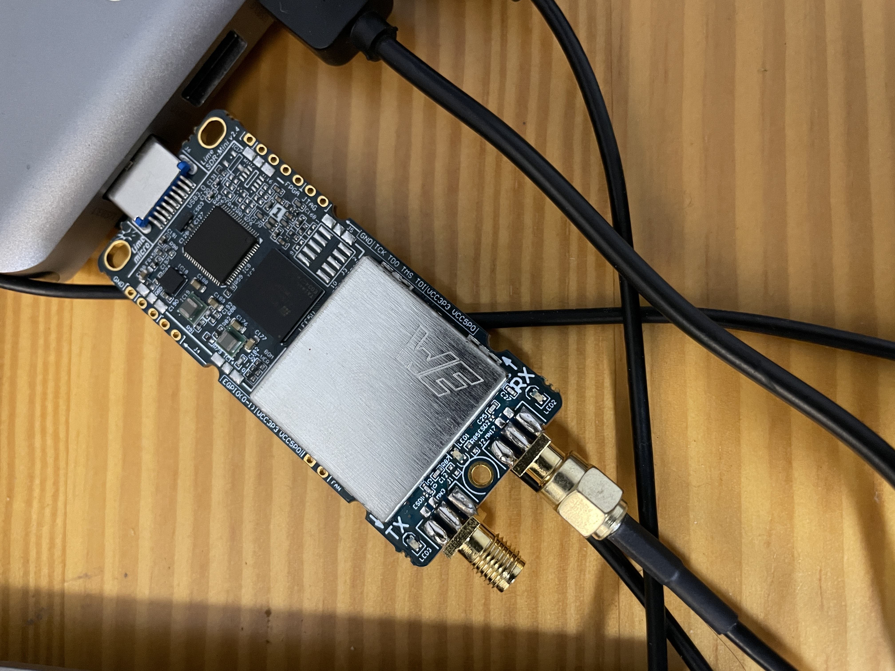
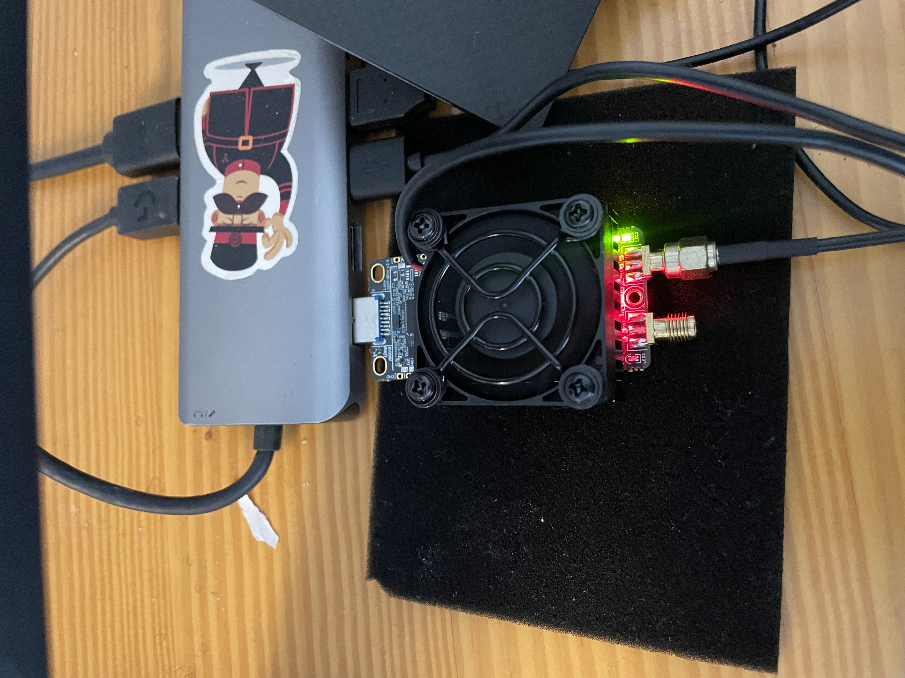
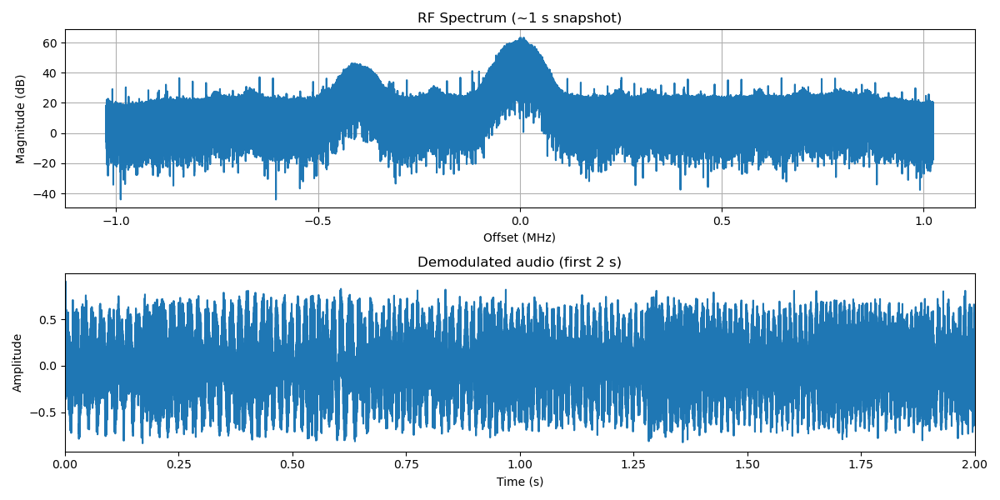
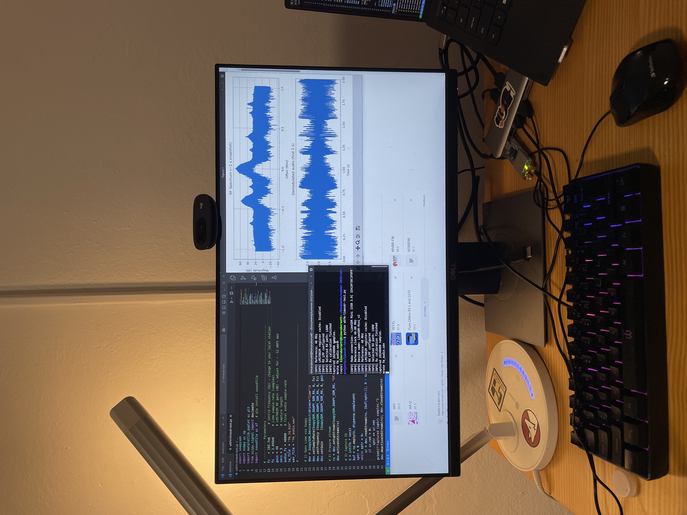

Ever wondered how you can turn your computer and a simple Software-Defined Radio (SDR) into a buttery-smooth, real-time FM receiver and spectrum analyzer? It might seem complex, but with modern Python libraries, it's more achievable than you think.

<div style="display:flex; gap:1rem; justify-content:center;">

  <!-- Photo 1 -->
  <figure style="margin:0;">
    
    <figcaption style="text-align:center; font-size:0.9rem;">
      Without cooling fan
    </figcaption>
  </figure>

  <!-- Photo 2 -->
  <figure style="margin:0;">
    
    <figcaption style="text-align:center; font-size:0.9rem;">
      With cooling fan
    </figcaption>
  </figure>

</div>

<!-- Overall caption -->
<p style="text-align:center; font-style:italic; margin-top:0.5rem;">
  LimeSDR Mini v2.0: bare board vs. cooled.
</p>

The board kept overheating, so I ended up getting it a cooling fan.

## Part One: Simple FM Capture and Process

### 1\. Setting Up the SDR

First, the script needs to communicate with the SDR hardware. It uses the SoapySDR library, a universal hardware abstraction layer, to find and configure the LimeSDR. It sets three crucial parameters:

- Center Frequency (```fc```): This tells the SDR which radio station to listen to (e.g., 103.7 MHz).

- Sample Rate (```fs```): This defines how many data points (samples) of the radio waves are captured per second.

- Gain (```gain```): This is like a volume knob for the radio antenna, amplifying the faint incoming signals.

```python
# 1) Open Lime via Soapy
dev = SoapySDR.Device(dict(driver="lime"))
dev.setSampleRate(SoapySDR.SOAPY_SDR_RX, 0, fs)
dev.setFrequency (SoapySDR.SOAPY_SDR_RX, 0, fc)
dev.setGain      (SoapySDR.SOAPY_SDR_RX, 0, gain)

# 2) Prepare stream
rx = dev.setupStream(SoapySDR.SOAPY_SDR_RX, "CF32")
dev.activateStream(rx)
```

### 2\. Capturing and Understanding IQ Data

The script then captures five seconds of this configured radio signal into a NumPy array. The data being captured is not simple audio; it's **IQ data**.

Think of a radio wave at a single instant as a vector it has both an amplitude (strength) and a phase (its position in the wave cycle). IQ data represents this vector using two numbers: the I (**In-phase**) component and the Q (**Quadrature**) component. By storing these two values for every sample, we perfectly preserve the original radio wave's amplitude and phase. This is why the data type is ```np.complex64```, a complex number is the ideal mathematical tool for storing these two related values.

```python
# 3) Capture IQ
N = int(fs * secs)
buf = np.empty(N, dtype=np.complex64)
sptr = 0
while sptr < N:
    sr = dev.readStream(rx, [buf[sptr:]], N - sptr)
    if sr.ret > 0:
        sptr += sr.ret
```

### 3\. The Core of FM Demodulation

Now we have the raw radio signal, but how do we get sound out of it? This is where the digital signal processing (DSP) begins. For wideband FM, the script uses a straightforward two-step process.

**FM Discriminator**: The audio information in an FM signal is encoded in its frequency changes. A simple way to extract this is to calculate the change in phase between each consecutive sample. This line of NumPy code does it beautifully by multiplying the signal by a one-sample-delayed version of itself and finding the angle.

**Decimation**: The signal's sample rate is over 2 MHz, which is way too high for audio. scipy.signal.decimate is used to drastically lower the sample rate to a standard 48 kHz. As a bonus, this function also applies a high-quality filter that removes unwanted noise and artifacts.

```python
# 4) Basic wide-FM demodulation
#    a) FM discriminator (phase diff)
dphi = np.angle(buf[1:] * np.conj(buf[:-1]))
#    b) De-emphasis & decimate to audio_fs
audio = decimate(dphi, int(fs / audio_fs), ftype='fir')
```

The resulting audio is then normalized and saved as a .wav file.

<audio controls>
  <source src="../assets/images/posts/lime-sdr-fm/fm_audio.wav" type="audio/wav">
  Your browser does not support the audio element.
</audio>

### 4\. Visualizing the Results

Finally, to confirm everything worked, the script uses Matplotlib to create two plots.

**RF Spectrum**: This shows the frequency content of the raw radio signal we captured. You can clearly see the powerful broadcast signal at the center, surrounded by the noise of the radio spectrum.

**Audio Waveform**: This is a plot of the final, demodulated audio signal, showing the classic shape of sound waves over time.

```python
# 5) Visualisation
plt.figure(figsize=(12, 6))

# Spectrum (first 1 M samples)
plt.subplot(2, 1, 1)
# ... code to plot spectrum ...
plt.title("RF Spectrum (~1 s snapshot)")

# Audio waveform (first 2 s)
plt.subplot(2, 1, 2)
# ... code to plot audio ...
plt.title("Demodulated audio (first 2 s)")

plt.tight_layout(); plt.show()
```

<figure style="text-align:center;">
  
  <figcaption style="margin-top:0.4rem;">
    RF Spectrum and Time Domain Signal
  </figcaption>
</figure>


This simple script was a fantastic starting point, demonstrating the entire core workflow of an SDR application: capture, process, and visualize.

<figure style="text-align:center;">
  
  <figcaption style="margin-top:0.4rem;">
    Monitor with Spectrum Plot and Command Line Output
  </figcaption>
</figure>

Full code and instructions on how to run it are on my [GitHub](https://github.com/kmarulab/sdr-projects/tree/main/limesdr-fm-test) and the initial virtual environment setup remains the same for part two.

## Part Two: Real-Time Radio Magic

The static script is powerful, but it's not a live radio. To listen continuously and interact with the radio, we need to solve several new problems: How do we process data constantly without freezing the program? How do we guarantee smooth, uninterrupted audio? We now provide the answers in this second half.

### 1\. Concurrency with Threading

A graphical user interface (GUI) needs to be responsive at all times. If you put a "blocking" function like dev.readStream inside a GUI loop, the entire application would freeze while waiting for data.

The solution is **concurrency**. The script launches a separate worker thread whose only job is to run the ```sdr_worker``` function. This function contains the loop that continuously reads data from the SDR. Because it runs in the background, the main thread is completely free to handle drawing the GUI, updating the spectrum plot, and responding to user keyboard and mouse inputs.

```python
#threads starts
threading.Thread(target=sdr_worker,daemon=True).start()
print("Buffering …")
start_play.wait()
print("Audio start …")
```

### 2\. The Producer-Consumer Model for Audio

To prevent audio glitches, the script implements a classic producer-consumer model.

- The producer is the ```sdr_worker``` thread. It continuously captures IQ data, processes it into audio chunks, and adds them to a shared buffer.

- The consumer is the ```audio_cb``` (callback) function, which is managed by the sounddevice library. The operating system's audio engine calls this function on a high-priority thread whenever the speakers need more data.

- The buffer is a ```deque``` (a double-ended queue), which is a highly efficient data structure for adding items to one end and removing them from the other.

Snippet from ```sdr_worker``` thread

```python
            # Audio
            audio = iq_to_audio(iq, sl_v.val)
            with state_lock:
                audio_buf.append(audio)
                global buf_samples, latest_iq
                buf_samples += len(audio)
                latest_iq = iq.copy()
                if buf_samples >= BUF_PREFILL:
                    start_play.set()
            # Back‑pressure
            while buf_samples > BUF_MAX and not stop_evt.is_set():
                time.sleep(0.02)

```

This system is governed by two key parameters to ensure stability:

- Prefill (```BUF_PREFILL```): The radio doesn't start playing immediately. First, it waits until the producer has filled the buffer with 0.5 seconds of audio (```PREFILL_S```). This initial buffer absorbs any processing delays and gives the consumer a healthy supply to start with, preventing underruns at startup.

- Back-Pressure (```BUF_MAX```): If the producer gets too far ahead of the consumer, it could fill up all the computer's RAM. To prevent this, if the buffer holds more than 1.5 seconds of audio (```MAX_BUF_S```), the producer thread will simply ```time.sleep``` for a short period, pausing itself until the consumer has had a chance to catch up.

```python
#audio callback
def audio_cb(outdata, frames, *_):
    global buf_samples
    need = frames
    chunks = []
    with state_lock:
        while need > 0 and audio_buf:
            c = audio_buf.popleft()
            buf_samples -= len(c)
            if len(c) <= need:
                chunks.append(c)
                need -= len(c)
            else:
                chunks.append(c[:need])
                audio_buf.appendleft(c[need:])
                buf_samples += len(c)-need
                need = 0
    if need: chunks.append(np.zeros(need, np.float32))
    outdata[:,0] = np.concatenate(chunks)
```

### 3\. Real-Time DSP Pipeline

The real-time script uses a more sophisticated DSP chain in its ```iq_to_audio``` function to produce cleaner audio. It includes the same FM discriminator and decimation as before, but adds three crucial new steps:

Low-Pass Filter: ```lfilter(B_LPF, A_LPF, audio)``` applies a carefully designed Butterworth low-pass filter. This filter has a sharp cutoff at 15 kHz. Its purpose is to remove the 19 kHz stereo pilot tone and any other non-audio data (like RDS data at 57 kHz) that are part of the FM broadcast but would sound like an annoying high-pitched whine if not removed.

De-emphasis Filter: To combat noise, FM stations boost high frequencies before transmission, a process called pre-emphasis. To restore the audio's natural tonal balance, the receiver must apply an equal and opposite de-emphasis filter. The line ```lfilter([1-ALPHA_DE], [1, -ALPHA_DE], audio)``` creates this filter, attenuating the high frequencies back to their original level.

High-Quality Resampling: After decimation (```FS_SDR / DECIM```), the audio sample rate is ```2,048,000 / 42 = 48,761.9... Hz```. This is very close, but not identical, to the standard 48_000 Hz that sound cards expect. Playing it directly would result in a slight pitch error. The resample_poly(audio, 160, 163) function corrects this perfectly. It's a polyphase resampling algorithm that mathematically rescales the signal to the target sample rate, ensuring perfect pitch. The numbers 160 and 163 are a rational fraction (```160/163 ≈ 48000 / 48761.9```) that tells the function how to perform this conversion.

```python
def iq_to_audio(iq: np.ndarray, vol: float) -> np.ndarray:
    audio = fm_disc(iq)
    audio = decimate(audio, DECIM, ftype='fir')
    audio = lfilter(B_LPF, A_LPF, audio)
    audio = lfilter([1-ALPHA_DE], [1, -ALPHA_DE], audio)
    audio -= np.mean(audio)
    audio = resample_poly(audio, 160, 163)  # 48 762 → 48 000
    audio /= (np.max(np.abs(audio)) + 1e-3)
    return (audio * vol).astype(np.float32)
```

### 4\. Building an Interactive GUI

Instead of the blocking ```plt.show()``` used in the first script, the real-time application uses ```plt.ion()``` (interactive mode on) and runs its own GUI loop.

Inside this loop, it first grabs the latest IQ data from the worker thread. It then calculates the FFT for the spectrum display and updates the plot data using ```line_psd.set_data(...)```. Crucially, it ends the loop with ```fig.canvas.draw_idle()``` and ```plt.pause(0.05)```. This tells Matplotlib to redraw the screen when it has a free moment and then yields control for 50 milliseconds. This tiny pause is enough for the GUI to remain responsive to user input, such as arrow keys for tuning or the volume slider, creating a fluid and truly interactive experience.

```python
#gui refresh loop
try:
    while plt.fignum_exists(fig.number):
        with state_lock:
            iq = latest_iq.copy() if latest_iq is not None else None
        if iq is not None:
            spec = 20*np.log10(np.abs(np.fft.fftshift(np.fft.fft(iq[:FFT_N]*window)))+1e-9)
            wf_deque.pop()
            wf_deque.appendleft(spec.astype(np.float32))
            freqs = freq_axis + sl_f.val
            line_psd.set_data(freqs,spec)
            ax_psd.set_xlim(freqs[0],freqs[-1])
            wfi.set_data(np.vstack(wf_deque))
            wfi.set_extent([freqs[0],freqs[-1],0,WF_ROWS])
        fig.canvas.draw_idle()
        fig.canvas.flush_events()
        plt.pause(0.05)
except KeyboardInterrupt:
    pass
```

<figure style="text-align:center;">
  <video src="../assets/images/posts/lime-sdr-fm/realtime-demo.mp4"
         controls
         style="max-width:100%; height:auto;">
    <!-- Fallback text for very old browsers -->
    Your browser does not support the video tag.
  </video>
  <figcaption style="margin-top:0.4rem;">
    Real-time FM Radio and Spectrum Analyzer Demo
  </figcaption>
</figure>

## Reflections

This project was a fantastic learning experience, especially since I started with no background in concurrency. Tackling the simple static capture script first was an invaluable strategy, as it let me get a feel for how the SDR works and solidify the signal processing logic on its own. When I moved to the real-time version, I initially struggled with weird beeping noises, which turned out to be classic symptoms of audio buffering issues in multi-threaded applications. This is where using an AI assistant like ChatGPT really came in handy; it was instrumental in helping me debug the complex threading problems and grasp the concurrency concepts I needed to make the live receiver work smoothly. Gemini helped with modularizing the code into files each with core functions. The folder modular contains all the files.

All the code as well as other RF related projects are on my github, repo named [sdr-projects](https://github.com/kmarulab/sdr-projects).
