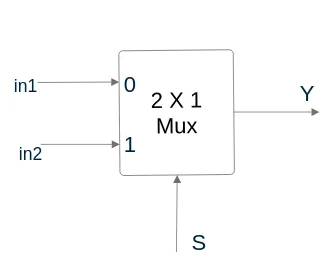
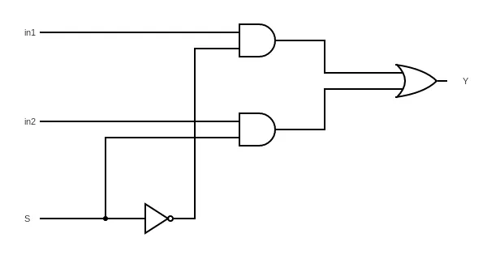
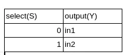
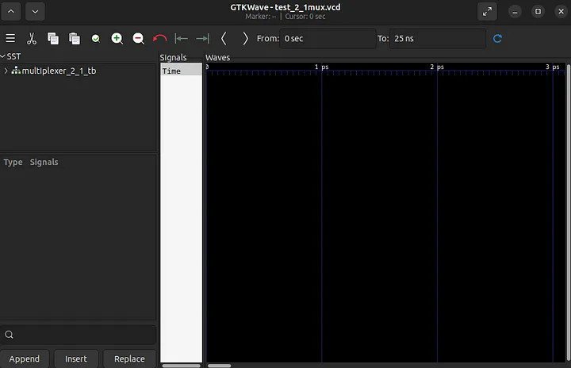
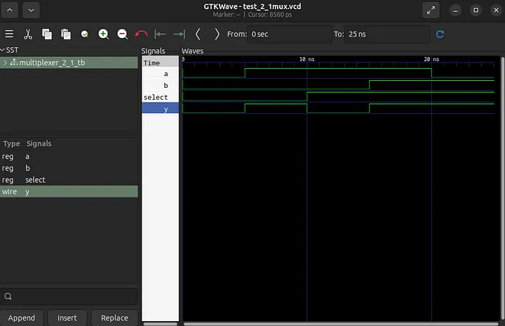

[Home](../../index.html) [Blog Index](../blog.html)
Kimaru Boruett, October 2023

This is a repost of a blog post I made on medium sometime back. 

Hardware Description Languages (HDLs) are employed to define the operations of electronic and digital systems. Verilog is a notable example. In the industry, other frequently utilized HDLs include VHDL and SystemVerilog, which serve dual purposes for both design and verification. Additionally, there are less widely recognized but still effective HDLs like Chisel (built on Scala), Hardcaml (built on OCaml), and cocotb, which is commonly utilized for creating testbenches for VHDL, SystemVerilog, and Verilog in Python.

In this tutorial, we are going to install Icarus Verilog and GTKWave, then as an example, write a multiplexer and its testbench in Verilog.

# Installing Icarus Verilog
Icarus Verilog is an open source compiler for the Verilog HDL.

Update Ubuntu package list, then install Icarus Verilog using the apt install command

```bash
sudo apt update
sudo apt install iverilog
```

# Installing GTKWave
GTKWave is a waveform viewer that seamlessly works with Icarus Verilog to display simulation results. It is conveniently available in Ubuntu’s apt package list, therefore we will use the ```apt install``` command once more.

```bash
sudo apt install gtkwave
```

With both Icarus Verilog and GTKWave installed, we are going to create a simple Verilog project to verify and test their functionality.

# Creating a Multiplexer in Verilog
A multiplexer is a combinational logic circuit that’s used to select only one input from several inputs based on selection lines. In most cases there usually are 2^n input lines and n selection lines whose combinations determine which input is selected.

Our project will be a 2x1 multiplexer. It therefore has 2 input lines and one select line.

||
|:--:| 
|*Block Diagram for 2x1 Multiplexer*|

||
|:--:| 
|*Logic Diagram for 2x1 Multiplexer*|

Below is the truth table for the above 2x1 Multiplexer. When S=0, output will be switched to in1 input, then when S=1, output will be switched to in2 output.

||
|:--:| 
|*Truth Table for 2x1 Multiplexer*|

Now that we have some context about the 2x1 multiplexer, we’ll proceed to implement it in Verilog and develop a testbench to simulate its behavior.

Organizing our files is a great practice. Here’s how we can navigate to the ```Documents``` directory, create a ```DigitalDesign``` folder, and then create a ```Multiplexer_2_1``` folder within it, assuming we're starting from the home directory:

``` bash
cd Documents
mkdir DigitalDesign
cd DigitalDesign
mkdir Multiplexer_2_1
cd Multiplexer_2_1
```
Now, within the ```Multiplexer_2_1``` folder located in the ```DigitalDesign``` directory, we’re ready to implement our Verilog project. We’ll use the nano text editor to create a Verilog file for the multiplexer.

```bash
nano multiplexer_2_1.v
```
Below is the Verilog code for the multiplexer. I recommend typing the code out by yourself while following along.
```verilog
module multiplexer_2_1(
  input a,
  input b,
  input select,
  output y
);

assign y = (select)?b:a;
endmodule
```

Save the file(Ctrl+O+Enter) and exit(Ctrl+X) the text editor

Now we are going to write the testbench

```bash
nano multiplexer_2_1_tb.v
```
Below is the Verilog testbench

```verilog
`timescale 1ns/100ps 
module multiplexer_2_1_tb;

 //inputs
 reg a, b, select;
 //outputs
 wire y;

 multiplexer_2_1 u0_DUT(
  .a(a),
  .b(b),
  .select(select),
  .y(y)
 );

 //initialize inputs

 initial begin
//simulation files dumped to the test_2_1mux file
  $dumpfile("test_2_1mux.vcd");
  $dumpvars(0,multiplexer_2_1_tb);
  a=1'b0;b=1'b0; select=1'b0;
  #5 a=1'b1; 
  #5 select = 1'b1;
  #5 b=1'b1;
  #5 a=1'b0;
  #5 $finish;
 end
endmodule
```

Once we have saved and closed the file we can now use Icarus Verilog to compile our sources.

```bash 
iverilog -o mux_wave_2_1 multiplexer_2_1.v multiplexer_tb_2_1.v
```

Using the ```ls``` command we will see a new file by the name ```mux_wave_2_1``` produced when our sources are compiled. To run it we are going to use the ```vvp``` command, commonly associated with iverilog as its simulation runtime engine, which will produce another file by the name ```test_2_1mux.vcd``` as defined in our testbench code.

```bash
vvp mux_wave_2_1
```

To view the waveform, we are going to use GTKWave. GTKWave allows we to interactively explore and analyze the waveform data generated by our Verilog simulations, making it a key tool for debugging and understanding the behavior of our designs.

```bash
gtkwave test_2_1mux.vcd
```

A GTKWave window will appear.

||
|:--:| 
|*GTKWave Window After running Command on Terminal*|

Select the Appropriate Module: In the left panel of the GTKWave window, we will see a list of modules. Look for the module associated with our simulation, which in this case is likely named “multiplexer_2_1_tb.” It will be represented with a tree-like icon.

Select Signals to View: In the module tree, select the signals we want to view in the bottom panel. To do this, simply click on the signals one by one in the order we’d like to view them. They will appear in the bottom panel.

Display Waveforms: Once we’ve selected the signals, the main waveform window will populate itself with the selected signals. We will see the waveforms representing the behavior of these signals over time.

Adjust the Scale: We can adjust the scale of the waveform to better visualize changes. Use the zoom in and zoom out icons or the scaling options in the GTKWave toolbar to zoom in or out until we can clearly see the waveform changes.

||
|:--:| 
|*GTKWave Window with Waveform*|

At 5ns: The input a becomes 1, and as a result, the output y also becomes 1 because the select pin is set to 0, meaning it selects input a.

At 10ns: The select pin is set to 1, causing the multiplexer to switch its selection to input b. Consequently, y drops to 0 because it now reflects the value of b.

At 15ns: Input b becomes 1, causing the output y to change to 1 since the multiplexer is still selecting input b due to the earlier set select value.

At 20ns: Input a becomes 0, but it doesn't affect the output y at this point since the select pin remains at 1, continuing to select input b. Thus, y remains at 1.

We can modify the testbench variables then re-run the simulation followed by the accompanying steps to observe how our changes affect the waveform.

You can find the code in the github repository linked below.

[code location](https://github.com/kmarulab/RTL_100Days)

My inspiration for this project and writing came from Raul Behl’s “100 Days of RTL,” where he employed SystemVerilog. Throughout this endeavor, he undertook progressively complex projects as the days advanced. I hope to do the same, probably not in 100 Days😂

Our next project will be a D flip-flop.

Thank you!

Sources Cited

    Mano, M. M., & Ciletti, M. D. (2019). Digital Design: With an introduction to the Verilog HDL, VHDL, and systemverilog. Pearson Education.
    GeeksforGeeks. (2023, September 19). Multiplexers in digital logic. [Geeks for Geeks](https://www.geeksforgeeks.org/multiplexers-in-digital-logic/)